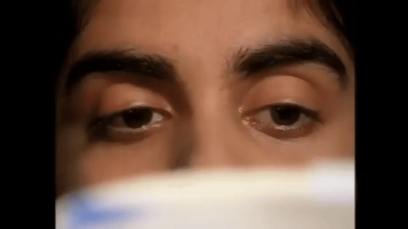

# Reading!!

Say you are a researcher who is interested in reading. As you can see in Figure 1, the eyes perform saccades between words while reading. Say you are a researcher who is interested in reading. As you can see in Figure 1, the eyes perform saccades between words while reading. Say you are a researcher who is interested in reading. As you can see in Figure 1, the eyes perform saccades between words while reading. Say you are a researcher who is interested in reading. 

<figure class="float-right">
  
  <figcaption> Eyes perform saccades while reading. Source: <a href="https://www.youtube.com/watch?v=bSEWrbcrFc0">Reading Rockets</a>.</figcaption>
</figure>
As you can see in Figure 1, the eyes perform saccades between words while reading. Say you are a researcher who is interested in reading. As you can see in Figure 1, the eyes perform saccades between words while reading. Say you are a researcher who is interested in reading. As you can see in Figure 1, the eyes perform saccades between words while reading.
As you can see in Figure 1, the eyes perform saccades between words while reading. Say you are a researcher who is interested in reading. As you can see in Figure 1, the eyes perform saccades between words while reading. Say you are a researcher who is interested in reading. As you can see in Figure 1, the eyes perform saccades between words while reading.

## The SWIFT model

The SWIFT model is a computational model of eye-movements during reading introduced by Engbert et al. (2005).

$$\frac{da_w}{dt} = r \lambda_w(t)$$

As you can see in Figure 1, the eyes perform saccades between words while reading. Say you are a researcher who is interested in reading. As you can see in Figure 1, the eyes perform saccades between words while reading. Say you are a researcher who is interested in reading. As you can see in Figure 1, the eyes perform saccades between words while reading.
As you can see in Figure 1, the eyes perform saccades between words while reading. Say you are a researcher who is interested in reading. As you can see in Figure 1, the eyes perform saccades between words while reading. Say you are a researcher who is interested in reading. As you can see in Figure 1, the eyes perform saccades between words while reading.